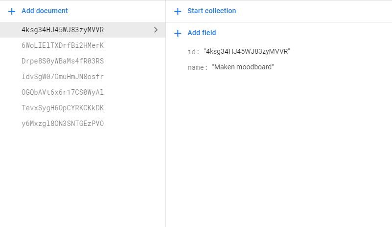

# Google Firebase and React JS

This project was made with [Google Firebase](https://console.firebase.google.com/?pli=1) and [Javascript JS](https://reactjs.org/)

## About

This project uses my Firebase Database and writes all the data back to the website. 

## More features

Its also possible to use the CRUD elements in this applications.

C - Create new data and add it to the database. All data gets an unique key so there should be no conflicts between duplicate values.  
R - Read all the data that is added in the Database  
U - Update the excisting data in the database to your favour.  
D - Delete the excisting data in the database.

## See pictures

